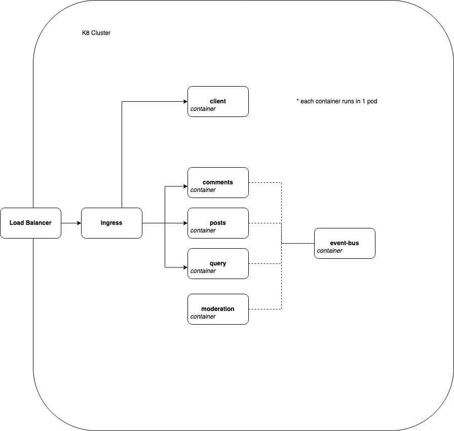

## About

Mini-project to learn & explore microservice architecture.
Each component is built from scratch e.g instead of using existing event bus, a custom event bus is developed to better understand and appreciate how it works.

## Technologies

- Docker
- Kubernetes
- Node.js
- ReactJS

## Diagram



## Services-Port Mapping

| Service    | Port |
| ---------- | ---- |
| Client     | 3000 |
| Posts      | 4000 |
| Comments   | 4001 |
| Query      | 4002 |
| Moderation | 4003 |
| Event Bus  | 4005 |

## Set-up

Append to `/etc/hosts`:

```
127.0.0.1 posts.com
```

Apply K8s files:

```
skaffold dev
```
